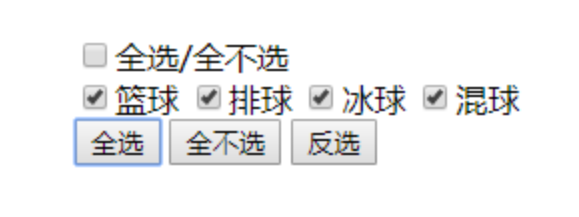

# @开发组第`2`期培训

## 概要：

主要学习内容为`JavaScript`，`JavaScript`作为一门脚本语言，不同于服务端开发可以选择`Java, c++, go`等语言，客户端（前端）开发的唯一语言，后期的框架也是基于`JavaScript`, 因此本周学习内容非常重要，需要比上周更加认真

## 学习内容

### 主题：`JavaScript`

### 视频资源：

完整`JavaScript`教程

https://www.bilibili.com/video/BV1YW411T7GX

https://www.bilibili.com/video/BV1Kq4y1e7d2

### 网站文档资源：

- `w3cshool`

  https://www.w3school.com.cn/index.html

- 菜鸟教程

  https://www.runoob.com/

### 开发环境：

- 视频中都是以**浏览器中`JavaScript`解释器**内核运行`JavaScript`
- 自己有兴趣可以搭建`node.js`的环境，可以**不借助**浏览器的解释器

### 案例作业：

输出`100~200`之间的素数

```javascript
output: 2, 3, 5, 7, 11, 13, 17, 19, 23... 
```

计算x的阶乘

```javascript
testcase:
input: 0, output: 1
input: 4, output: 24
```

判断是否为闰年

```javascript
testcase:
input: 2020, output: true
input: 2021, output: false
```

寻找指定子串在父串出现的所有位置，将所有位置下标保存在一个数组中，返回出来

```javascript
input : 'abcd,abcd&abcd-abcd', 'abcd'
output: [0, 5, 10, 15]
```

给定一段文本，以空格分割，各个单词首字母大写

```javascript
input: 'hello world javascript'
output: 'Hello World Javascript'
```

去字符串头尾空格

```javascript
input: '  trim  '
output: 'trim'
```


打印99乘法表

在网页页面同步当前时间

实现操作按照下面规则，并**弹出价格**

```javascript
加油站，为了鼓励车主多加油，实行多加多优惠政策，具体优惠如下：
已知92号汽油，每升6元；如果大于等于20升，那么每升5.9
已知97号汽油，每升7元；如果大于等于40升，那么每升6.5
最终弹窗弹出价格
```

实现全选/全部不选操作



点击改变盒子大小


